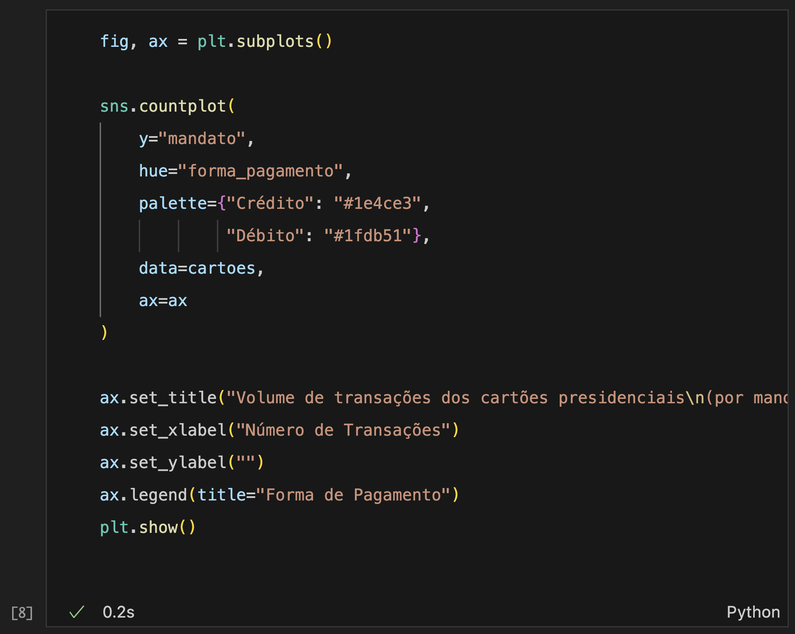

# Bases de dados e tipos de variáveis | Countplot
**Programação para Advogados – 2024.2**
José Luiz Nunes e Lucas Thevenard

---

<!-- 
paginate: true 
header: Aula 2 - Bases de dados e tipos de variáveis | Countplot
footer: jose.luiz@fgv.br | lucas.gomes@fgv.br | 12/08/2024
-->

## Roteiro de Aula
- Bases de dados e tipos de variáveis
- A sintaxe do countplot
- Aula prática: vamos programar!
  - Preparação: configuração do VS Code
  - Nosso primeiro gráfico
- Exercício

---

## Bases de dados e tipos de variáveis

- O que é uma base de dados?
  * Dados estruturados e não estruturados
  * Dados tabulares (tabela)
  * Como organizar dados tabulares?
    * Conceito de **tidy data**

---

## Tidy Data

- **Conceito**: alinhamento entre a estrutura dos dados e sua semântica (significado).
- **Regra centrais**:
  * Linhas são observações
  * Colunas são variáveis
  * Apenas uma unidade de observação (ou de análise) por tabela

---

## Tidy Data

---

## Tidy Data

- Vamos construir um exemplo com uma tabela de alunos da sala.
  - **Unidade de observação**: Alunos
  - **Variáveis**: Nome, Matrícula, Altura, Ano de Nascimento, Signo, Cor Favorita
* Como construir uma tabela de jurisprudência no escritório?

---

### O Ciclo da Ciência de Dados

 

---

# Vamos para o código

---

### Bibliotecas para dados e visualizações

 

---

### Carregar os dados da aula

 

---

### Dados de pagamentos dos cartões presidenciais

 

---

## Dicionário dos dados

- **data_pgto**: a data em que o pagamento foi realizado, no formato YYYY-MM-DD.
- **ano**: O ano em que a transação foi realizada, como número inteiro.
- **mes**: O mês em que a transação foi realizada, como número inteiro (1 = Janeiro, 2 = Fevereiro, etc).
- **forma_pagamento**: A forma de pagamento utilizada, que pode ser `"Crédito"` ou `"Débito"`.
- **valor**: O valor do pagamento realizado, em reais brasileiros (R$), como número decimal.

---

## Dicionário dos dados

- **tipo_despesa**: A classificação orçamentária da despesa detalhada.
- **nome_fornecedor**: A razão social ou nome do favorecido.
- **cpf_servidor**: Os 6 últimos dígitos, antes do código verificador, do Cadastro de Pessoa Física (CPF) do agente suprido (que realizou o pagamento).
- **mandato**: Identifica o mandato no qual aconteceu o pagamento.
- **posicao_mandato**: Variável numérica que representa a ordem do mandato no qual aconteceu o pagamento.

---

### Vamos aprender a fazer o nosso primeiro gráfico

---

## Primeiro Gráfico

- Contagem do uso das duas formas de pagamento: Crédito vs. Débito.
* Usamos a função `sns.countplot()`
  * `data=cartoes`: definimos qual DataFrame (dados) usar.
  * `x="forma_pagamento"`: qual coluna/variável dos dados queremos plotar, em qual eixo.

 

---

### Como poderíamos inverter os eixos do gráfico?

---

## Eixo invertido

- Invertemos os eixos definindo a função com a variável de contagem no eixo y.
  - Para isso usamos o argumento `y="forma_pagamento"` na função `sns.countplot()`.
  * Em que casos faz sentido fazer isso?

 

---

## Problema dos nomes sobrepostos no eixo x

- Um problema comum é termos a sobreposição dos nomes. Isso ocorre quando temos
  - **Muitas categorias**.
  - **Nomes longos** das categorias.
- Veja ao lado o que ocorre quando tentamos plotar os mandatos no eixo x.

 

---

## Invertendo os eixos eliminamos a sobreposição

- Uma forma simples de eliminar o problema das sobreposições é inverter os eixos.
* Agora responda:
  - **Em qual mandato houve o maior gasto no cartão presidencial?**

 

---

## Cruzando duas variáveis

- Podemos usar o argumento `hue` para cruzar duas variáveis.
- Veja ao lado o número de transações de cada presidente por forma de pagamento.

---

### Ainda podemos melhorar esse gráfico...

 

---

### Agora mãos à obra!

---

## Config do Visual Studio Code

  

- **Guia de Configuração do VS CODE**
  - Disponível no EClass
  - Link de acesso: [bit.ly/config_vscode](bit.ly/config_vscode)

