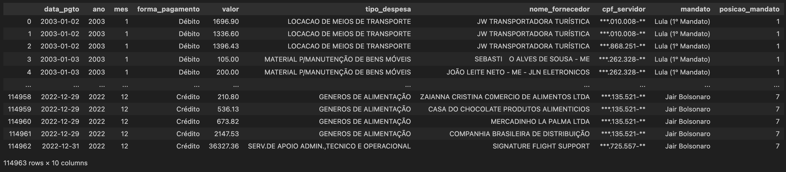

<style>

:root{
  font-family: "Source Sans Pro", sans-serif;
}

section {
  background-image: url(default_bg.png);
  font-family: "Source Sans Pro", sans-serif;
}
h1, h2, h3, strong {
  color: #003E7E;
}
h3, h4, h5 {
  text-align: center;
}
h4, h5 {
  font-weight: normal;
}
h1 {
  font-size: 200%;
}
h2, h3 {
  font-size: 150%;
}
h4 {
  font-size: 100%;
}
h5 {
  font-size: 75%;
}
header, a {
  color: #058ED0;
}
header {
  font-size: 85%;
}
footer {
  color: black;
  font-size: 60%;
}
blockquote {
  background: #f9f9f9;
  font-style: italic;
  font-family: Source Sans Pro;
  font-size: 80%;
  line-height: 170%;
  border-left: 10px solid #ccc;
  margin: 1.5em 20px;
  padding: 1.2em 30px;
  quotes: "\201C""\201D""\2018""\2019";
}
blockquote p {
  display: inline;
}
section::after {
  content: attr(data-marpit-pagination) ' / ' attr(data-marpit-pagination-total);
  color: #003E7E;
  font-size: 60%;
}
table {
  margin-left: auto;
  margin-right: auto;
}
th {
  background-color: #003E7E;
  color: white
}
.columns {
  display: grid;
  grid-template-columns: repeat(2, minmax(0, 1fr));
  gap: 1rem;
}
.columns3 {
  display: grid;
  grid-template-columns: repeat(3, minmax(0, 1fr));
  gap: 1rem;
}
.codeimage {
  display: grid;
  grid-template-columns: 35% 65%;
  gap: 1rem;
}
span.under {
  text-decoration: underline;
}

span.fade {
  color: lightgray!important;
}

section > h2 {
  flex: 0.2 0 auto;
  padding: 0;
  margin: 0;
  order: -999999;
}

section:has(> h2)::before {
  flex: 1 0 auto;
  display: block;
  content: '';
  order: 999999;
}

</style>


# Gráficos de barras - Variáveis categóricas X numéricas

**Programação para Advogados – 2024.2**
José Luiz Nunes e Lucas Thevenard

---

<!-- 
paginate: true 
header: Aula 3 - Variáveis numéricas e barras | barplot
footer: jose.luiz@fgv.br | lucas.gomes@fgv.br | 19/08/2024
-->

## Revisão

- O que vimos até aqui?

- Que tipo de gráfico o countplot gera?

- Quais tipos de variáveis estavam sendo usadas?

---

<div class="columns">
<div>

## Revisão

- Gráficos são "representações geométricas dos dados"
* Qual atributo dos dados esta sendo representado?


</div>
<div>

<br>


</div>
</div>

---


<div class="columns">
<div>

## Revisão

- Gráficos são "representações geométricas dos dados"
- Qual atributo dos dados esta sendo representado?
  - Eixo X - Categorias (barras diferentes)
  - Eixo Y - Contagem (altura das barras)


</div>
<div>
<br>


</div>
</div>

---

<div class="columns">
<div>

## Revisão

- Gráficos são "representações geométricas dos dados"
- Qual atributo dos dados esta sendo representado?
  - Eixo X - Categorias (barras diferentes)
  - Eixo Y - Contagem (altura das barras) - **aqui o seaborn criou uma variável numérica para nós!**


</div>
<div>
<br>


</div>
</div>

---


<div style="text-align: center">

# Mas e se quisermos representar algo além de uma contagem?

</div>

---

## Gráficos de barras

- Barras representam em um eixo uma variável categórica e no outro uma variável numérica

- O countplot cria um gráfico de barras. Mas limitado a uma "função de agregação": contagem

- Para outras funções de agregação, usamos o `barplot`: e.g. soma e média

---

## Gráficos de barras

- Nossas observações devem ter: 
  - Uma variável categórica
  - Uma variável numérica

- Podemos também ter outras variáveis categóricas para segmentar o gráfico (i.e. cor pelo `hue`)

---

## Gráficos de barras

- Gráficos são "representações geométricas dos dados"

- Quais atributos geométricos são usados em um gráfico de barras?

  1. Tamanho das barras
  2. Barras diferentes

---

## Gráficos de barras

- Gráficos são "representações geométricas dos dados"

- No gráfico de barras o tamanho da barra é a codificação de nossa variável numérica

- Devemos manter a relação de seu formato com o valor representado

---

## Gráficos de barras

<div class="columns">
<div>

<br>


</div>
<div>


</div>
</div>

---

## Gráficos de barras

<div class="columns">
<div>

<br>


</div>
<div>


</div>
</div>

---

## Gráficos de barras

- Gráficos são "representações geométricas dos dados"

- Violar a relação entre os dados representados e a geometria cria gráficos *enganosos*

- Gráficos de barra sempre devem começar em 0!

---

## Gráficos de barras

- Cores não são estritamente necessárias em gráficos de barras

- Quando devemos usar cores?

---

## Gráficos de barras - Exemplos


<div style="margin: 0 auto">


</div>


---

## Gráficos de barras - Exemplos


<div style="margin: 0 auto">


</div>


---

## Gráficos de barras - Exemplos


<div style="margin: 0 auto">


</div>

---

## Gráficos de barras - Exemplos

<div class="columns">
<div>

<br>


</div>
<div>

<br>
<br>


</div>
</div>

---

## Gráficos de barras

- Cores devem ser usadas com um **propósito**

- Exemplos:
  - Representar uma variável categórica adicional
  - Destacar algum elemento da visualização de acordo com nossa mensagem
  - Manter consistência com a identidade visual do projeto

---

### E como devemos ordenar?

---

## Gráficos de barras - Exemplos

<div class="columns">
<div>

<br>


</div>
<div>

<br>


</div>
</div>

---

### Barras estacadas?

---

## Gráficos de barras - Exemplos

<div style="margin: 0 auto">
<br>


</div>

---

## Gráficos de barras - Exemplos

<div style="margin: 0 auto">
<br>


</div>

---

## Gráficos de barras - Exemplos

<div style="margin: 0 auto">
<br>


</div>

---


<div style="text-align: center">

# Voltando aos dados?

</div>

---

## Voltando aos dados

- Quais variáveis numéricas temos disponíveis?

<br>
<div style="margin: 0 auto">



</div>

---

## Voltando aos dados

- ``"Ano"``, `"mes"`, e `"posicao_mandato"` são variáveis numéricas?

<br>
<div style="margin: 0 auto">


</div>

---

## Voltando aos dados

- Vamos focar na variável ``"valor"``

---


<div style="text-align: center">

# Vamos abrir o VSCode

# Notebook no e-class

</div>

---

## Nosso primeiro gráfico de barras

<div class="codeimage">
<div>

<br>

```python
sns.barplot(
    y="mandato",
    x="valor",
    data=cartoes,
)
```
<br>

[Documentação barplot](https://seaborn.pydata.org/generated/seaborn.barplot.html)

</div>
<div>

<br>


</div>
</div>

---

## Vamos adicionar o argumento

<div class="codeimage">
<div>

<br>

```python
sns.barplot(
    y="mandato",
    x="valor",
    estimator="mean",
    data=cartoes,
)
```
<br>

[Documentação barplot](https://seaborn.pydata.org/generated/seaborn.barplot.html)

</div>
<div>

<br>


</div>
</div>

---

## Soma de cada presidente

<div class="codeimage">
<div>

<br>

```python
sns.barplot(
    y="mandato",
    x="valor",
    estimator="sum",
    data=cartoes,
)
```
<br>

</div>
<div>

<br>


</div>
</div>

---

## Soma de cada presidente

<div class="codeimage">
<div>

<br>

```python
sns.barplot(
    y="mandato",
    x="valor",
    estimator="sum",
    data=cartoes,
)
```
<br>
<p style=font-size:22>
Por enquanto vamos viver com a notação científica
</p>

</div>
<div>

<br>


</div>
</div>

---

## Soma de cada presidente

<div class="codeimage">
<div>

<br>

```python
sns.barplot(
    y="mandato",
    x="valor",
    estimator="sum",
    errorbar=None,
    data=cartoes,
)
```
<br>

</div>
<div>

<br>


</div>
</div>

---

## Vamos ajustar as cores

<div class="codeimage">
<div>

<br>

```python
sns.barplot(
    y="mandato",
    x="valor",
    estimator="sum",
    errorbar=None,
    color="tab:gray",
    data=cartoes,
)
```
<br>

<p style=font-size:22>
<a href=https://matplotlib.org/stable/gallery/color/named_colors.html>Cores disponíveis</a>
</p>

</div>
<div>

<br>


</div>
</div>

---

## Vamos ajustar as cores

<div class="codeimage">
<div>

<br>

```python
sns.barplot(
    y="mandato",
    x="valor",
    color="#134a91",
    estimator="sum",
    errorbar=None,
    data=cartoes,
)
```
<br>

<p style=font-size:22>
<a href=https://tinyurl.com/27pvvaj9>Como escolher cores</a>
</p>

</div>
<div>

<br>


</div>
</div>

---

## Qual presidente mais gastou nos cartões corporativos?

<div style="text-align: center">


</div>

---


<div style="text-align: center">


</div>

---

## Podemos usar o `hue` também no barplot

<div class="codeimage">
<div>

<br>

```python
sns.barplot(
    y="mandato",
    x="valor",
    hue="forma_pagamento",
    estimator="sum",
    errorbar=None,
    data=cartoes,
)
```
<br>

</div>
<div>


</div>
</div>

---

## E ajustar as cores

<div class="codeimage">
<div>

<br>

```python
sns.barplot(
    y="mandato",
    x="valor",
    hue="forma_pagamento",
    palette=["tab:gray", "#134a91"],
    estimator="sum",
    errorbar=None,
    data=cartoes,
)
```

</div>
<div>


</div>
</div>

---

## Meu gráfico final com hue para média

<div style="text-align: center">


</div>

