

# Histplot: Conhecendo o formato de uma distribuição de valores 
**Programação para Advogados – 2024.2**
José Luiz Nunes e Lucas Thevenard

---
<!-- 
paginate: true 
header: Histplot: Conhecendo o formato de uma distribuição de valores 
footer: jose.luiz@fgv.br | lucas.gomes@fgv.br | 19/08/2024
-->

## Roteiro da Aula
- O que é um histograma?
* Base de dados: IDH
* Criando o histograma no Python
  - Função `histplot()`
  - Formato de distribuições
* Mudando textos do gráfico

---

## O que é um histograma?

- A tabela ao lado mostra a altura de 15 alunos. Como podemos representar graficamente os intervalos de valor mais representativos?
* Vamos contar o número de alunos que aparecem em cada faixa de valor.

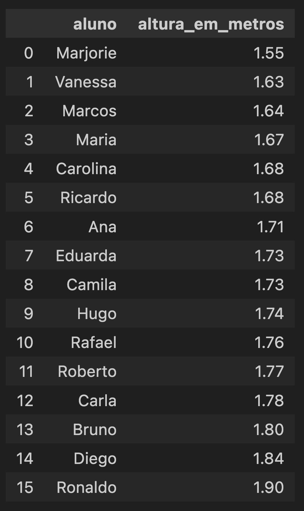

---

## O que é um histograma?

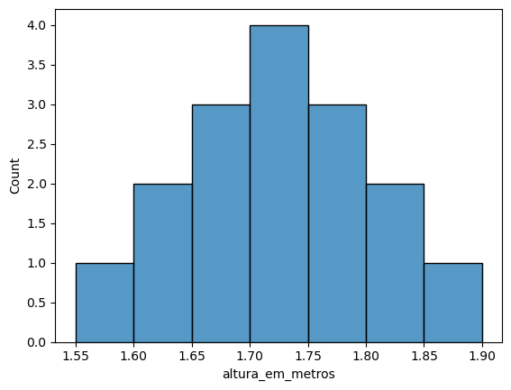

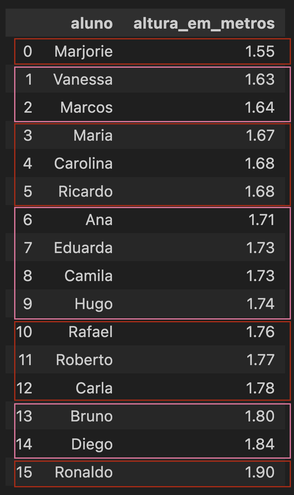

---

## O que é um histograma?

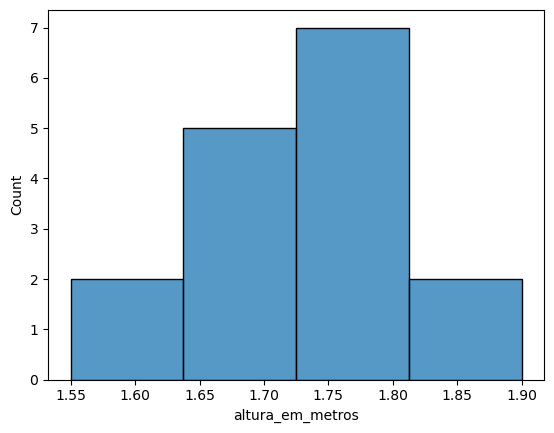

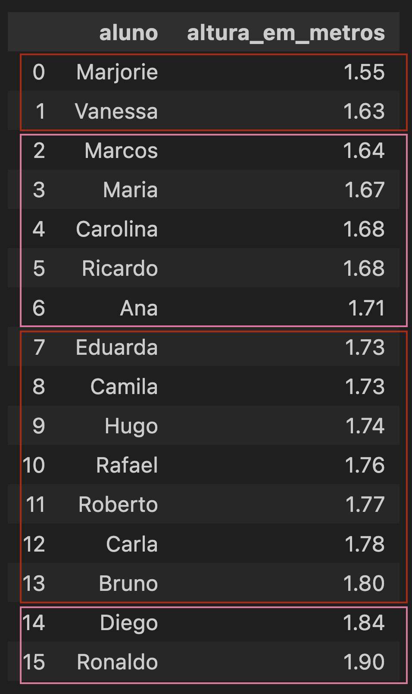

---

## O que é um histograma?

 

- E se dividíssemos os alunos em 30 intervalos diferentes de altura?
- O que você acha que aconteceria com o gráfico nesse caso?

 

---

 

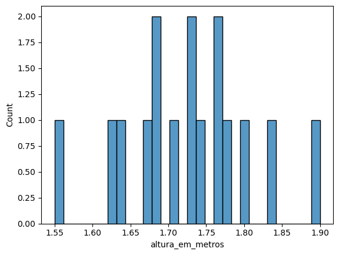

---

### Alternativas ao histograma: density plot e ECDF

 

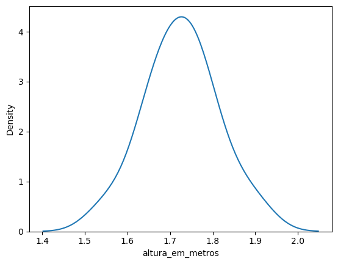

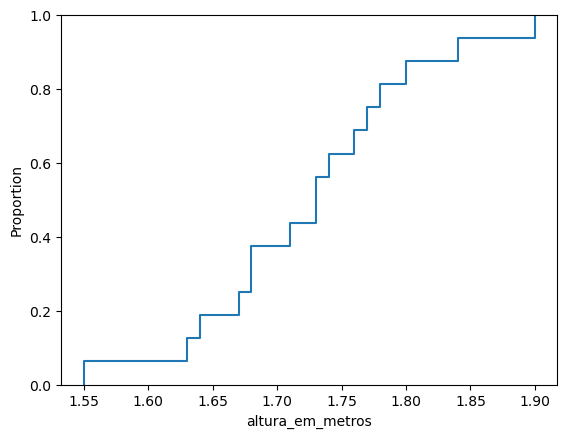

---

## Vamos aos dados de hoje: IDH

- Hoje vamos trabalhar com uma base de dados nova, uma base que tem informações do Índice de Desenvolvimento Humano (IDH).
* Antes vamos recordar um pouco da importância de trabalharmos com dados em formato **tidy**.
  * **Tidy**: Observações nas linhas, variáveis nas colunas, unidade de análise fixa!
  * Vamos ver como os dados do IDH foram disponibilizados:
    - Dados em [excel](https://lthevenard.github.io/curso_prog/aulas/aula4/idh_1.xlsx) e [microdados em CSV](https://lthevenard.github.io/curso_prog/aulas/aula4/idh_2.xlsx) no [site do IDH](https://hdr.undp.org/data-center/human-development-index#/indicies/HDI).

---

## Nossa base final

- **Unidade de análise**: dados por país por ano.
  - Cada coluna representa uma medida do país naquele ano (IDH, Escolaridade Média, Renda Per Capita etc.).

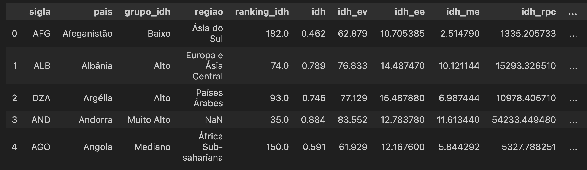

---

## Nossa base final

- **Escopo**: 194 países.
  - Base completa: valores de 1990 a 2022 (6435 observações de 28 variáveis).
  - Base 2022: 194 observações de 27 variáveis.

---

## Nossa base final

- Vamos utilizar hoje dados do próprio IDH e de suas componentes:
   - `idh`: Índice de Desenvolvimento Humano - IDH.
     - `idh_ev`: Expectativa de vida (Anos).
     - `idh_ee`: Expectativa de escolaridade (Anos).
     - `idh_me`: Média de escolaridade (Anos).
     - `idh_rpc`: Renda Per Capita (PPC$ em 2017).

---

## Dicionário de todas as colunas da base

- `sigla`: A sigla do nome do país (formato iso3).
- `pais`: O nome do país, em português.
- `grupo_idh`: A qual grupo da divisão do IDH feito pelas Nações Unidas o país pertencia em 2022. Há quatro grupos: `"Baixo"`, `"Mediano"`, `"Alto"`, `"Muito Alto"`.
- `regiao`: Região geográfica a que pertence o país, dentre as 6 categorias de classificação utilizadas pelas Nações Unidas (nem todos os países se enquadram em uma dessas 6 categorias).

---

## Dicionário de todas as colunas da base (cont.)

- `ranking_idh`: Posição do país no ranking do IDH de 2022.
- `idh`: Índice de Desenvolvimento Humano - IDH.
- `idh_ev`: Expectativa de vida (Anos).
- `idh_ee`: Expectativa de escolaridade (Anos).
- `idh_me`: Média de escolaridade (Anos).
- `idh_rpc`: Renda Per Capita (PPC$ em 2017).

---

## Dicionário de todas as colunas da base (cont.)

- `gdi`: Índice de Desenvolvimento de Gênero - IDG.
- `gdi_idh_f`: Índice de Desenvolvimento Humano Feminino.
- `gdi_idh_m`: Índice de Desenvolvimento Humano Masculino.
- `gdi_ev_f`: Expectativa de vida das mulheres (Anos).
- `gdi_ev_m`: Expectativa de vida dos homens (Anos).
- `gdi_ee_f`: Expectativa de escolaridade das mulheres (Anos).
- `gdi_ee_m`: Expectativa de escolaridade dos homens (Anos).
- `gdi_me_f`: Média de escolaridade das mulheres (Anos).
- `gdi_me_m`: Média de escolaridade dos homens (Anos).

---

## Dicionário de todas as colunas da base (cont.)

- `gdi_rpc_f`: Renda Per Capita das mulheres (PPC$ em 2017).
- `gdi_rpc_m`: Renda Per Capita dos homens (PPC$ em 2017).
- `extra_ap_f`: Assentos do parlamento ocupados por mulheres (%).
- `extra_ap_m`: Assentos do parlamento ocupados por homens (%).
- `extra_ft_f`: Mulheres com +15 anos na força de trabalho (%).
- `extra_ft_m`: Homens com +15 anos na força de trabalho (%).
- `extra_co2`: Emissão per capita de dióxido de carbono da produção (Toneladas).
- `extra_pop`: População Total.

---

### Mãos à obra!

---

### Passos Preliminares

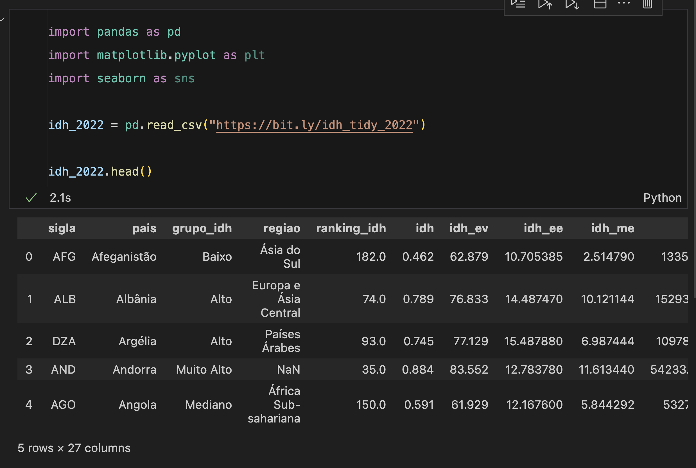

---

## Nosso primeiro histograma

- Vamos criar nosso primeiro histograma para ver a distribuição da expectativa de vida nos países.
* Usamos a função `sns.histplot()`
  * `data=idh_2022`: definimos qual DataFrame (dados) usar.
  * `x="idh_ev"`: qual coluna/variável dos dados queremos plotar, em qual eixo.

  

---

## Nosso primeiro histograma

- Vamos criar nosso primeiro histograma para ver a distribuição da expectativa de vida nos países.
* Usamos a função `sns.histplot()`
  * `data=idh_2022`: definimos qual DataFrame (dados) usar.
  * `x="idh_ev"`: qual coluna/variável dos dados queremos plotar, em qual eixo.

  

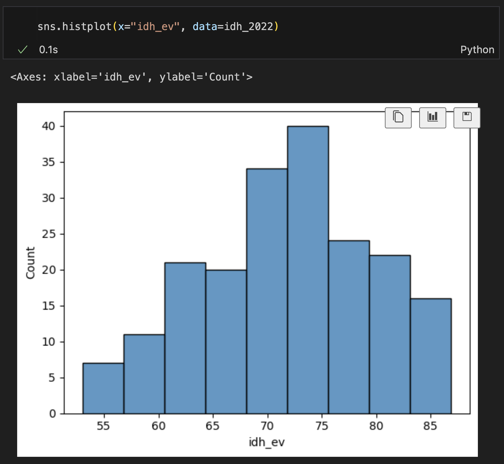

---

## Outro histograma

- Vamos criar um novo histograma, agora da expectativa de escolaridade, passado `x="idh_ee"` para a função `sns.histplot()`.
* Você reparou algo diferente no formato do gráfico? O número de barras é o mesmo do gráfico anterior?
  * A função `sns.histplot()` escolhe para nós o número de "bins" do nosso histograma, mas podemos interferir nessa escolha!

  

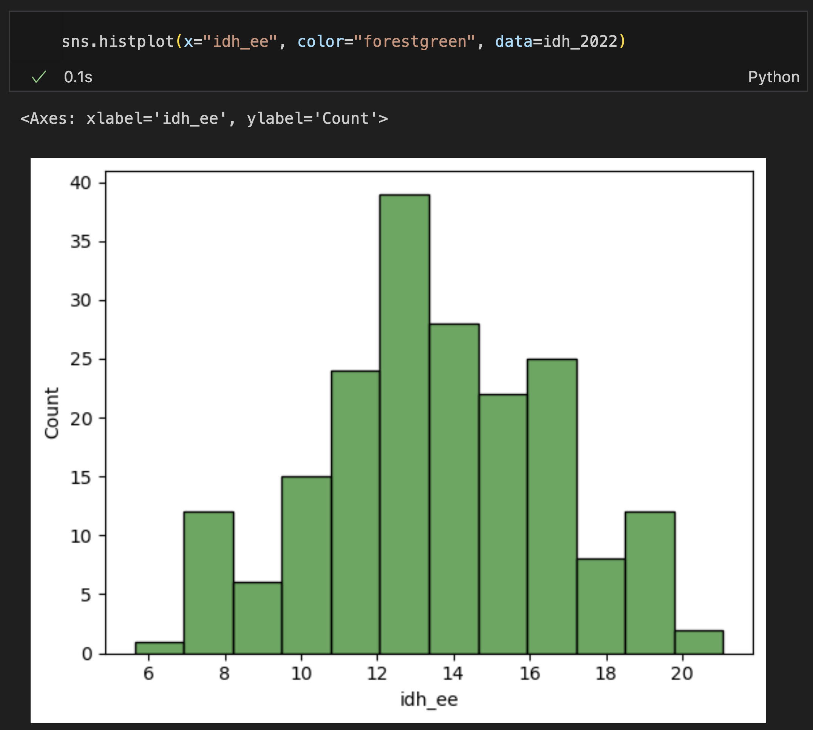

---

  

## Alterando os bins

- Podemos interferir na seleção dos bins de duas formas. 
  - A **primeira forma** consiste em estabelecer o número de bins com o parâmetro `bins`.

  

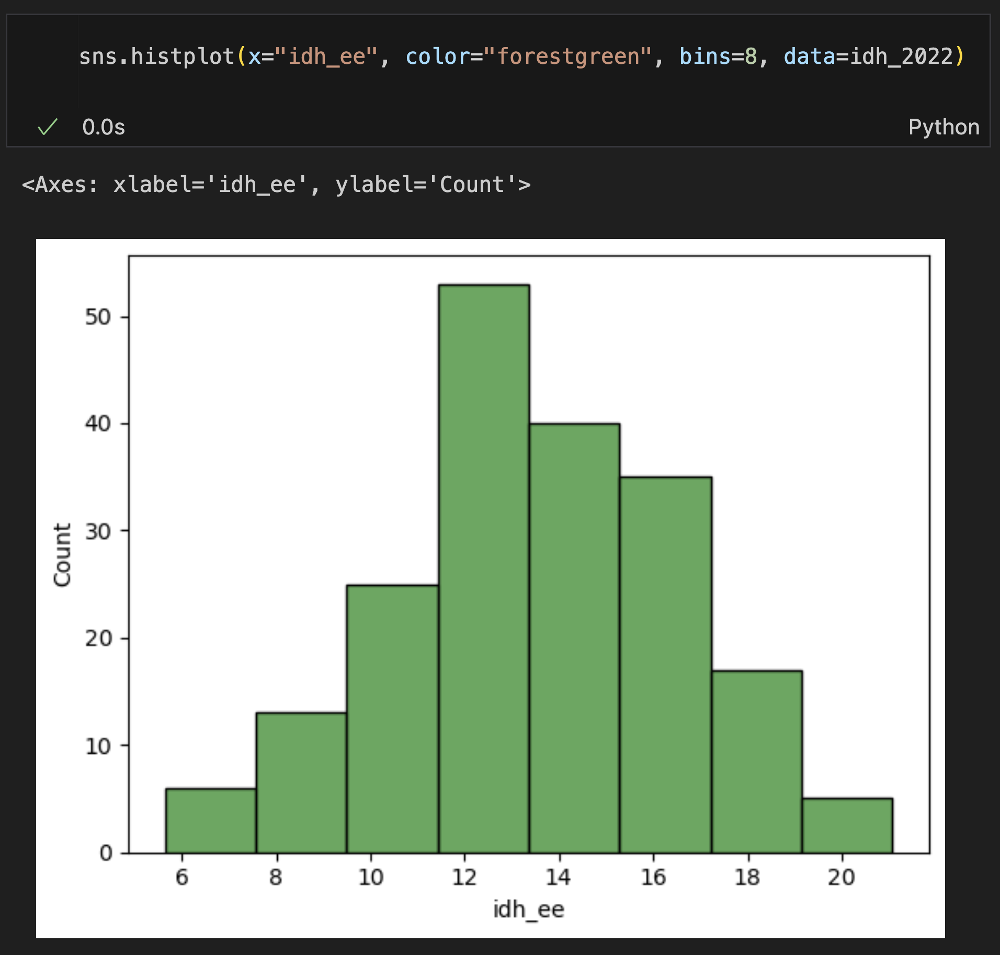

---

  

## Alterando os bins

- Podemos interferir na seleção dos bins de duas formas. 
  - A primeira forma consiste em estabelecer o número de bins com o parâmetro `bins`.
  - A **segunda forma** consiste em estabelecer o tamanho do intevalo com o parâmetro `binwidth`.

  

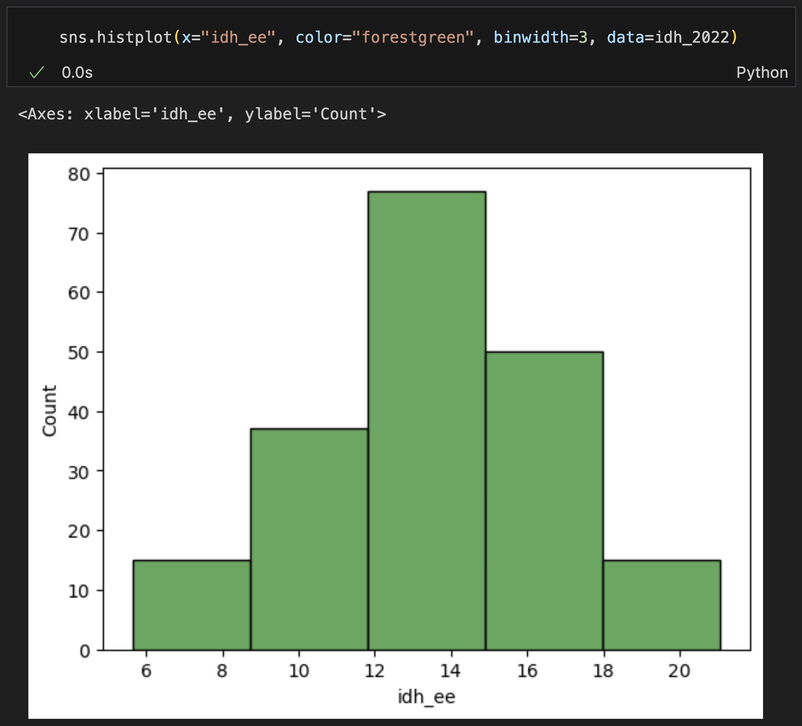

---

  

## Outras componentes

- Ainda vamos olhar para mais duas componentes do IDH.
  - A primeira delas é a **Média de Escolaridade**. Passamos `x=idh_me` para a função.

  

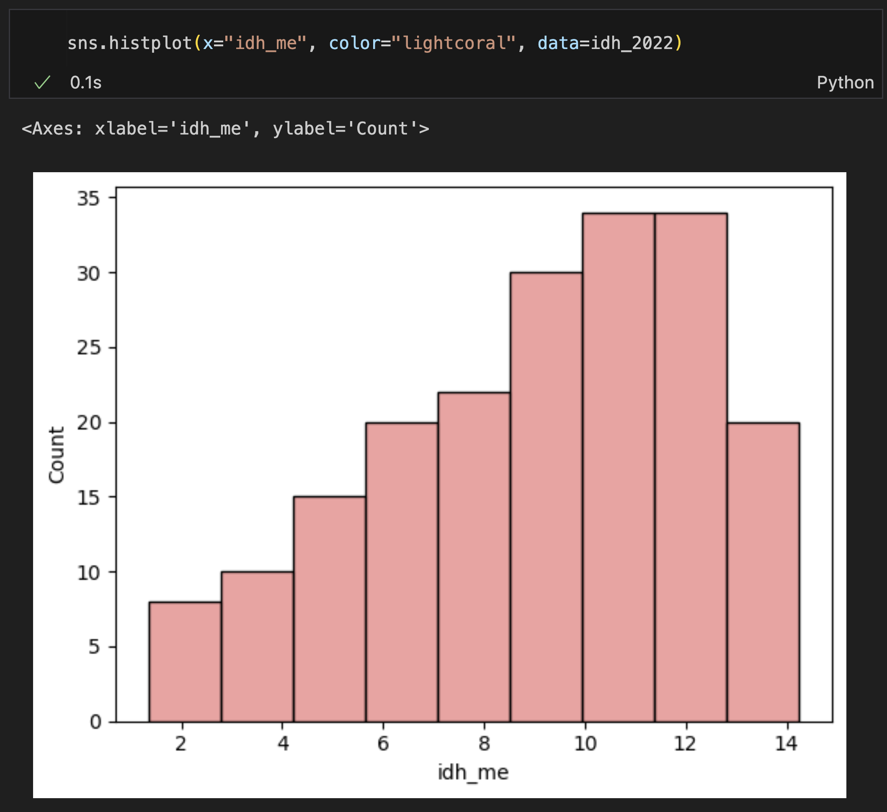

---

  

## Outras componentes

- Ainda vamos olhar para mais duas componentes do IDH.
  - A primeira delas é a Média de Escolaridade. Passamos `x=idh_me` para a função.
  - A segunda delas é **Renda Per Capita**. Passamos `x=idh_rpc` para a função.

  

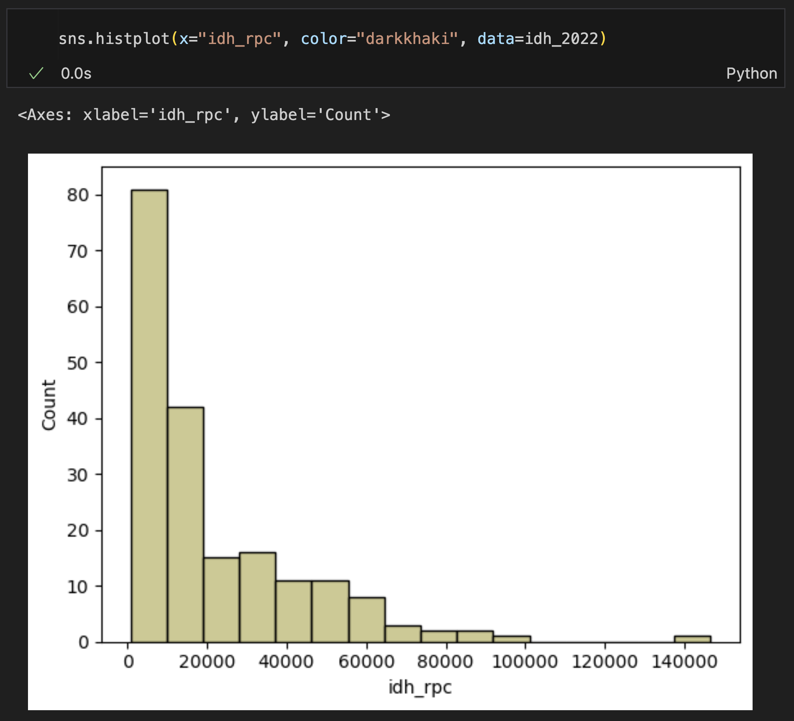

---

### Formatos de distribuições

---

## Mexendo nos textos do gráfico!

- Usamos a a função `subplots` da biblioteca `matplotlib` para criar dois objetos (`fig` e `ax`). Ao fazermos isso, podemos especificar as proporções do gráfico (o que não era possível antes) passando um par de valores para o argumento `figsize`.
* Passamos o objeto `ax` para o argumento de mesmo nome da função `histplot`.
* Usamos o objeto `ax` para alterar os textos: `ax.set_title()`, `ax.set_xlabel()`, `ax.set_ylabel()`.
* Mostramos o gráfico pronto com `plt.show()`.

---

### Mexendo nos textos do gráfico!

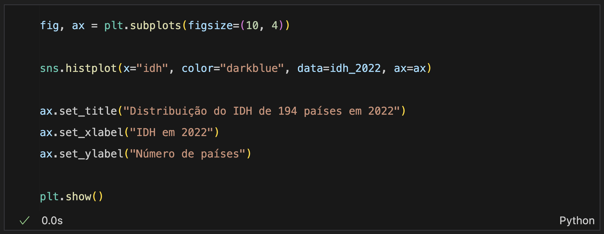

---

<!-- 
paginate: true 
header: ""
footer: ""
-->

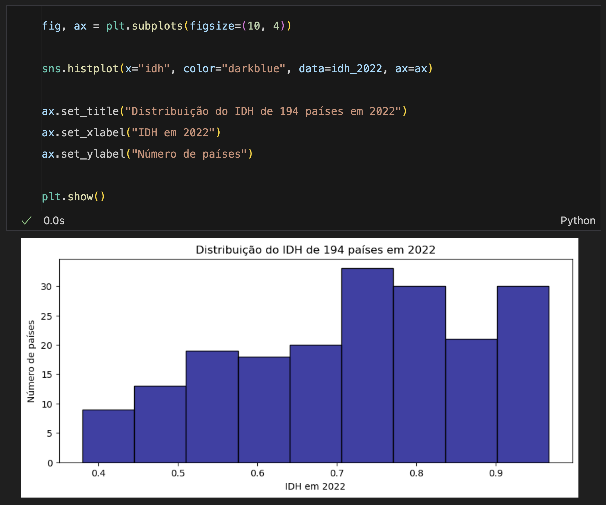

