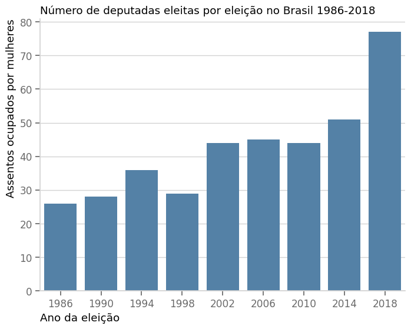
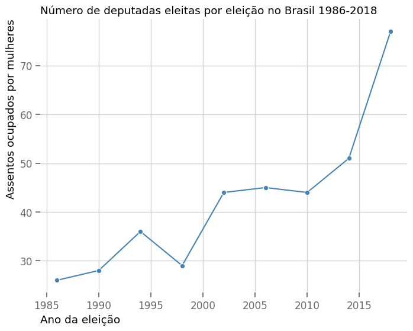
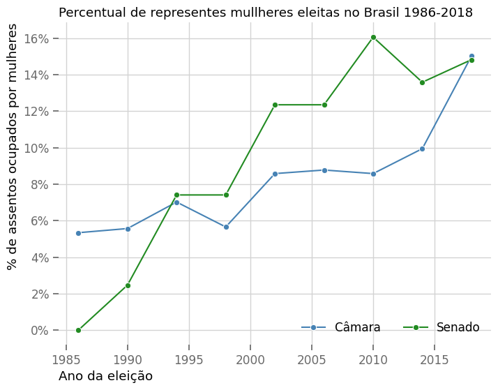
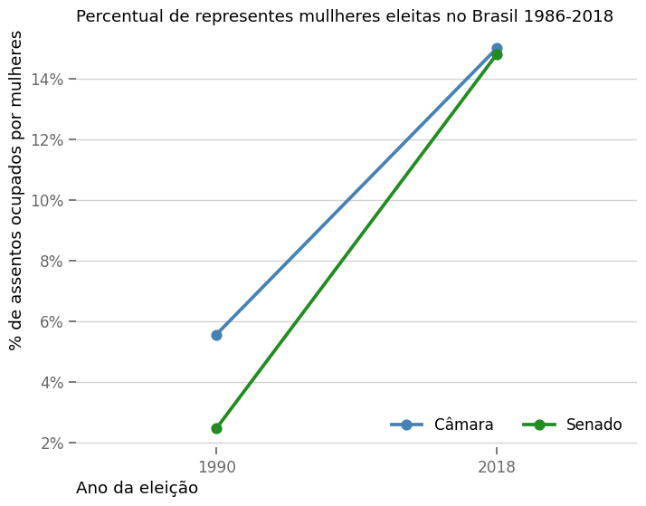
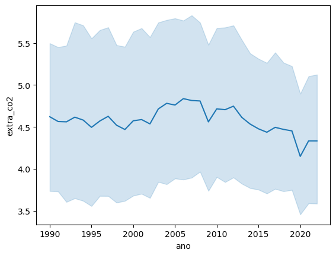
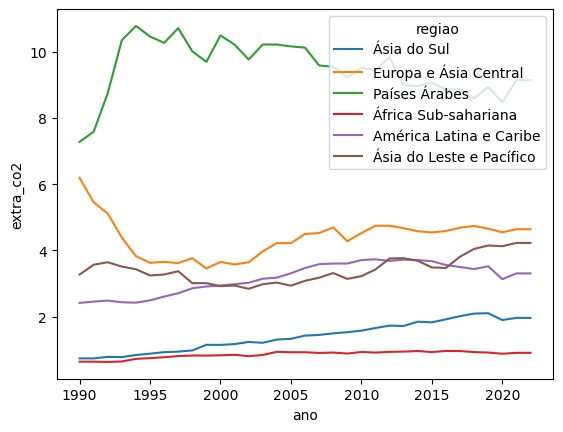
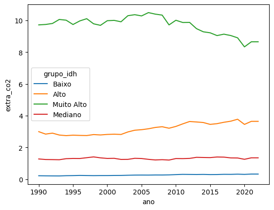
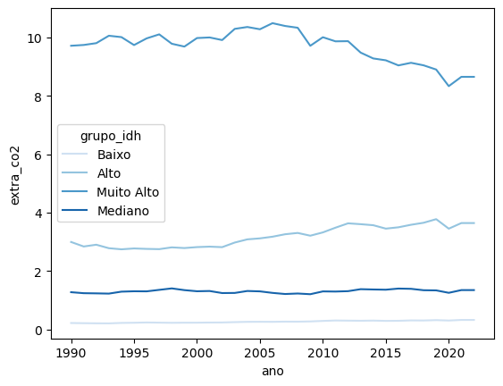
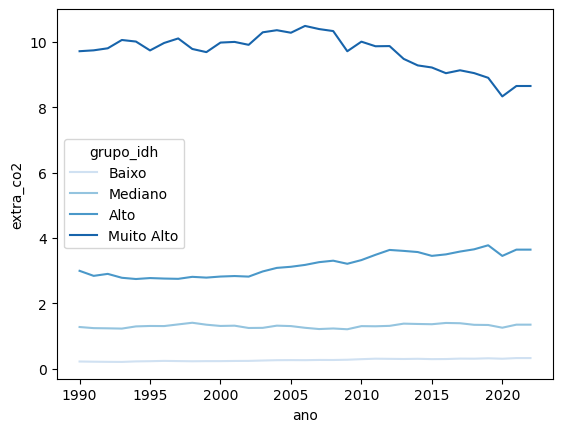
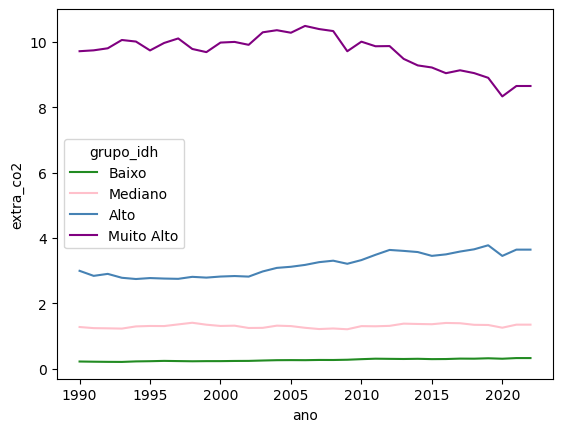

<style>

:root{
  font-family: "Source Sans Pro", sans-serif;
}

section {
  background-image: url(default_bg.png);
  font-family: "Source Sans Pro", sans-serif;
}
h1, h2, h3, strong {
  color: #003E7E;
}
h3, h4, h5 {
  text-align: center;
}
h4, h5 {
  font-weight: normal;
}
h1 {
  font-size: 200%;
}
h2, h3 {
  font-size: 150%;
}
h4 {
  font-size: 100%;
}
h5 {
  font-size: 75%;
}
header, a {
  color: #058ED0;
}
header {
  font-size: 85%;
}
footer {
  color: black;
  font-size: 60%;
}
blockquote {
  background: #f9f9f9;
  font-style: italic;
  font-family: Source Sans Pro;
  font-size: 80%;
  line-height: 170%;
  border-left: 10px solid #ccc;
  margin: 1.5em 20px;
  padding: 1.2em 30px;
  quotes: "\201C""\201D""\2018""\2019";
}
blockquote p {
  display: inline;
}
section::after {
  content: attr(data-marpit-pagination) ' / ' attr(data-marpit-pagination-total);
  color: #003E7E;
  font-size: 60%;
}
table {
  margin-left: auto;
  margin-right: auto;
}
th {
  background-color: #003E7E;
  color: white
}
.columns {
  display: grid;
  grid-template-columns: repeat(2, minmax(0, 1fr));
  gap: 1rem;
}
.columns3 {
  display: grid;
  grid-template-columns: repeat(3, minmax(0, 1fr));
  gap: 1rem;
}
.codeimage {
  display: grid;
  grid-template-columns: 35% 65%;
  gap: 1rem;
}

.codeimage2 {
  display: grid;
  grid-template-columns: 30% 70%;
  gap: 1rem;
}
span.under {
  text-decoration: underline;
}

span.fade {
  color: lightgray!important;
}

section > h2 {
  flex: 0.2 0 auto;
  padding: 0;
  margin: 0;
  order: -999999;
}

section:has(> h2)::before {
  flex: 1 0 auto;
  display: block;
  content: '';
  order: 999999;
}

</style>


# Gráficos de linha: linheplot e paleta de cores

**Programação para Advogados – 2024.2**
José Luiz Nunes e Lucas Thevenard

---

<!-- 
paginate: true 
header: Aula 5 - Gráficos de linha | Paleta de cores
footer: jose.luiz@fgv.br | lucas.gomes@fgv.br | 02/09/2024
-->

## Roteiro da Aula
- Gráficos de linha

- Paleta de cores e ordenando categorias

- Atribuindo cor para categoria


---

## Tendência de uma variável numérica no tempo

- Como podemos visualizar a evolução de uma variável numérica no tempo?

- Queremos enfatizar a tendência/evolução

---

## Tendência de uma variável numérica no tempo

Opção 1: vamos usar o já conhecido gráfico de barras

<div style="margin: 0 auto">



<div>

---

## Tendência de uma variável numérica no tempo

Opção 2: Podemos usar um gráfico de linhas

<div style="margin: 0 auto">



</div>

---
## Tendência de uma variável numérica no tempo


<div class="columns">
<div>

- Qual melhor mostra a evolução?


</div>
<div>

<br>


</div>
</div>

---

## Podemos também fazer comparações


<div style="margin: 0 auto">



</div>

---

## Podemos também fazer comparações

- Se queremos enfatizar início e fim poderíamos usar o `pointplot` apenas com o primeiro e último valor

<div style="margin: 0 auto">



</div>


---


<div style="text-align: center">

# Voltando aos dados: `sns.lineplot`

</div>

---

## Gráfico de linha

- Hoje vamos usar a função `lineplot` do Seaborn

- Vamos voltar aos dados do IDH, mas abordar a poluição per capita dos diferentes países
  * Essa variável é representada na coluna `extra_co2`


---

## Vamos carregar os dados

```python
import pandas as pd
import seaborn as sns
import matplotlib.pyplot as plt

df = pd.read_csv("https://bit.ly/idh_tidy")

df.head()
```

**Atenção:** Estamos mudando o nome da variável que contém nossos dados. Hoje vamos chamar o conjunto de dados (dataframe) de `df`.

1. Assim quando formos chamar as funções de plotagem, vamos usar `data=` ??

---

## Vamos carregar os dados

```python
import pandas as pd
import seaborn as sns
import matplotlib.pyplot as plt

df = pd.read_csv("https://bit.ly/idh_tidy")

df.head()
```

**Atenção:** Estamos mudando o nome da variável que contém nossos dados. Hoje vamos chamar o conjunto de dados (dataframe) de `df`.

1. Assim quando formos chamar as funções de plotagem, vamos usar **`data=df`**

---


## Gráfico de linha

<div class="codeimage">
<div>

<br>

O que devemos escrever em nosso código?
```python


```

</div>
<div>

<br>


</div>
</div>


---


## Gráfico de linha

<div class="codeimage">
<div>

<br>

O lineplot funciona de forma semelhante ao `barplot` 
```python
sns.lineplot(
    x="ano",
    y="extra_co2",
    data=df,
)
```

[Documentação lineplot](https://seaborn.pydata.org/generated/seaborn.lineplot.html)

</div>
<div>

<br>


</div>
</div>


---


## Gráfico de linha

<div class="codeimage">
<div>

<br>

O lineplot funciona de forma semelhante ao `barplot` 
```python
sns.lineplot(
    x="ano",
    y="extra_co2",
    data=df,
)
```

[Documentação lineplot](https://seaborn.pydata.org/generated/seaborn.lineplot.html)

</div>
<div>

<br>



</div>
</div>

---


## Gráfico de linha


O lineplot funciona de forma semelhante ao `barplot` 

Podemos:

- Remover a barra (sombra) de erro com `errorbar=None`
- Alterar o estimador de média para soma com `estimator=sum`


Vamos pular esses passos que já conhecemos e proceder direto para perguntas mais interessantes

---

## Gráfico de linha

Que pergunta poderíamos abordar do ponto de vista de tendência?

1. Como a poluição per capita evoluiu ao longo dos anos para países de diferentes regiões diferentes?
2. Qual a tendência de poluição per capita para países com diferentes níveis de IDH?

---

## Gráfico de linha

P1: Como a poluição per capita evoluiu ao longo dos anos para países de diferentes regiões diferentes?


<div class="codeimage">
<div>


```python
sns.lineplot(
    x="ano",
    y="extra_co2",
    ??
    ??
    ??
    ??
    data=df,
)
```
</div>
<div>


</div>
</div>

---

## Gráfico de linha

Evolução da poluição per capita por região:

<div class="codeimage">
<div>

Código:

```python
sns.lineplot(
    x="ano",
    y="extra_co2",
    hue="regiao",
    errorbar=None,
    data=df,
)
```
</div>
<div>



</div>
</div>

---

## Gráfico de linha

P1: Qual a tendência de poluição per capita para países com diferentes níveis de IDH?


<div class="codeimage">
<div>


```python


```
</div>
<div>


</div>
</div>

---

## Gráfico de linha

P1: Qual a tendência de poluição per capita para países com diferentes níveis de IDH?


<div class="codeimage">
<div>


```python
sns.lineplot(
    x="ano",
    y="extra_co2",
    hue="grupo_idh",
    errorbar=None,
    data=df,
)
```
</div>
<div>



</div>
</div>

---


### Agora vamos ajustar o gráfico

---

## Ajustes de gráfico

1. Vamos mudar a **paleta** de cores com o argumento `palette`


<div class="codeimage2">
<div>


```python
sns.lineplot(
    x="ano",
    y="extra_co2",
    hue="grupo_idh",
    errorbar=None,
    palette="Blues",
    data=df,
    ax=ax,
)
```
</div>
<div>



</div>
</div>

---

## Ajustes de gráfico

Mas a ordem da categoria está estranha, não?

<div style="margin: 0 auto">


</div>

---

## Ajustes de gráfico

2. Vamos ajustar a ordem das categorias com o argumento `hue_order`

Para isso precisamos criar uma lista com o nome das categorias na ordem desejada.

Para criar uma lista, usamos colchetes `[]` e separamos os elementos com vírgula. Como estamos lidando com texto, precisamos colocar cada categoria entre aspas `""`.


<br>

```python	
ordem_grupos = ["Baixo", "Mediano", "Alto", "Muito Alto" ]
```

---

## Ajustes de gráfico


<div class="codeimage">
<div>

```python	
ordem_grupos = [
  "Baixo",
  "Mediano",
  "Alto",
  "Muito Alto"
]

sns.lineplot(
    x="ano",
    y="extra_co2",
    hue="grupo_idh",
    hue_order=ordem_grupos,
    errorbar=None,
    palette="Blues",
    data=df,
    ax=ax,
)
```

</div>
<div>




</div>

---

## Ajustes de gráfico

2. Agora vamos definir as cores individuais que queremos usar 

Novamente, vamos criar uma lista. A correspondência das cores com categorias vai seguir a ordem que as categorias aparecem no gráfico.

```python
lista_cores = ["forestgreen", "pink", "steelblue", "purple"]
```


---

## Ajustes de gráfico

<div class="codeimage">
<div>

```python	

sns.lineplot(
    x="ano",
    y="extra_co2",
    hue="grupo_idh",
    hue_order=ordem_grupos,
    errorbar=None,
    palette=lista_cores,
    data=df,
    ax=ax,
)
```

</div>
<div>




</div>

---

## Ajustes de gráfico

Podemos estipular as cores diretamente para cada categoria também, mas precisamos criar um dicionário.

O dicionário associa uma chave (categoria) a um valor (cor). Usamos chaves `{}` para criar, ligando cada chave ao valor com `:` e separando os pares com vírgula.

```python
cores_grupos = {
  "Baixo": "lightblue",
  "Mediano": "pink",
  "Alto": "forestgreen",
  "Muito Alto": "steelblue",
}
```


---

## Ajustes de gráfico

<div class="codeimage">
<div>

```python	

sns.lineplot(
    x="ano",
    y="extra_co2",
    hue="grupo_idh",
    # Podemos usar o hue_order ou não
    # hue_order=ordem_grupos,
    errorbar=None,
    palette=cores_grupos,
    data=df,
    ax=ax,
)
```

</div>
<div>


</div>

---

## Nosso gráfico final


```python
fig, ax = plt.subplots(figsize=(10, 6))

# Escolha o gráfico que você preferiu da aula
sns.lineplot(
    x="ano",
    y="extra_co2",
    hue="grupo_idh",
    palette=cores_grupos,
    hue_order=ordem_grupos,
    errorbar=None,
    data=df,
    ax=ax,
)

ax.set_title("Emissão anual por nível de IDH em 2022")
ax.set_ylabel("Emissão de CO2 per capita (toneladas) média")
ax.set_xlabel("")
```

---


### Mãos a obra!