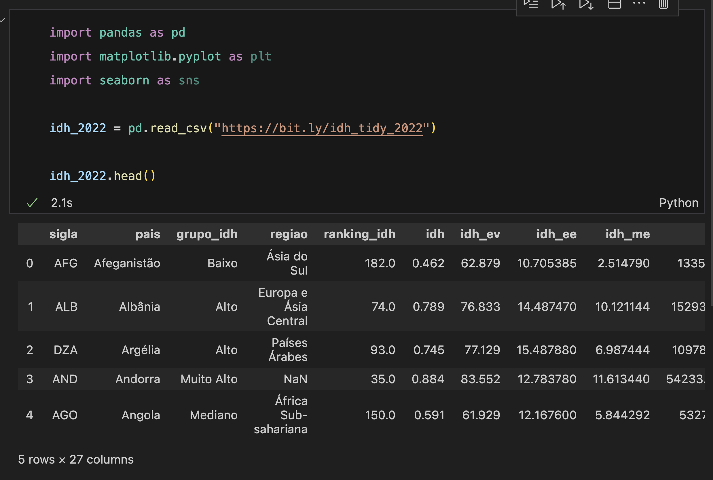
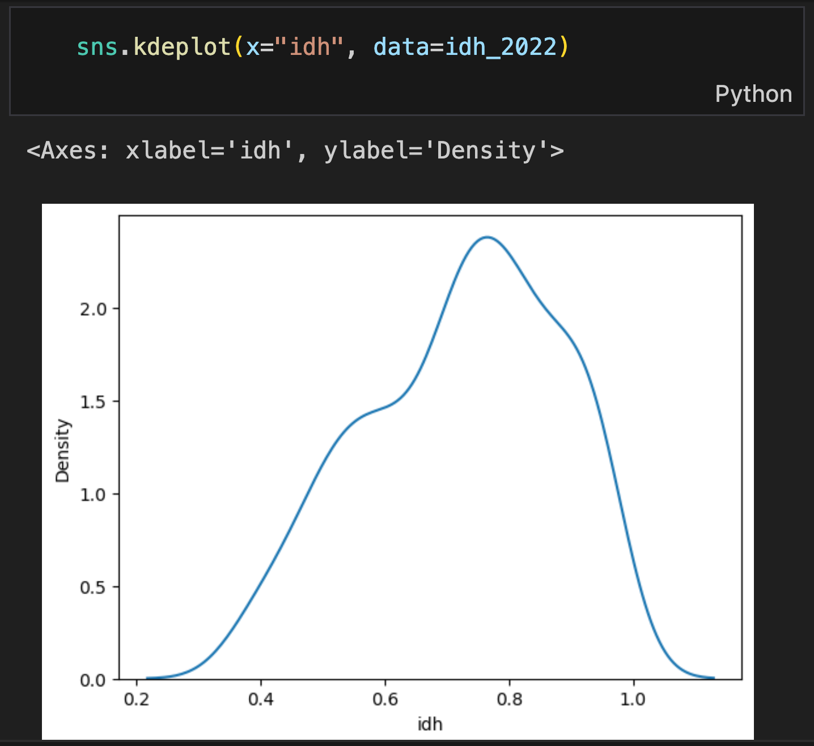
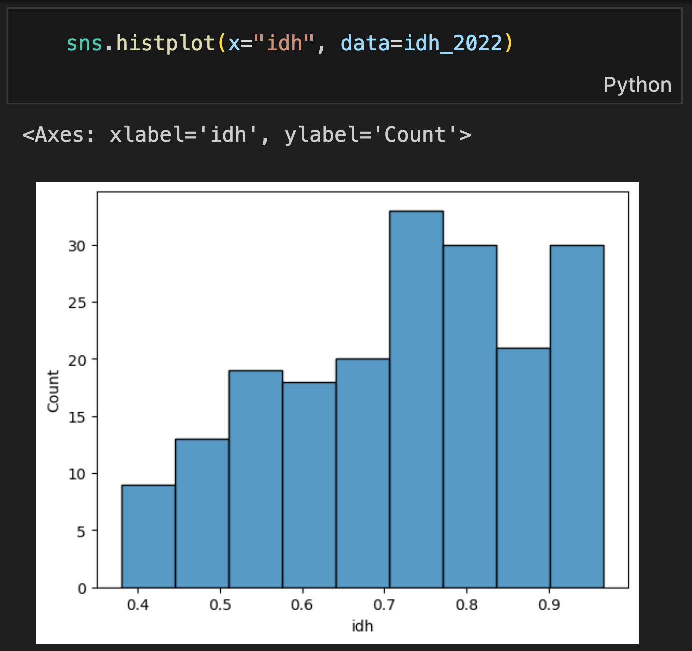
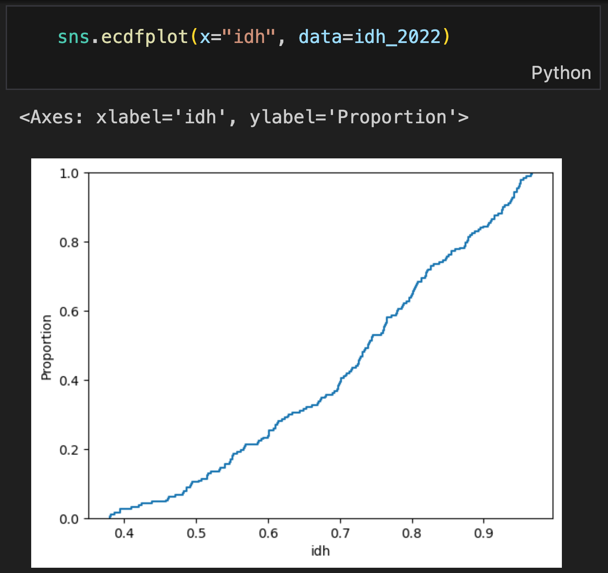
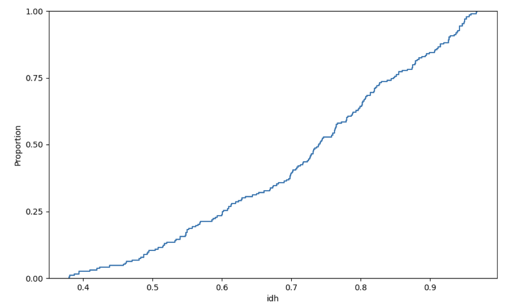
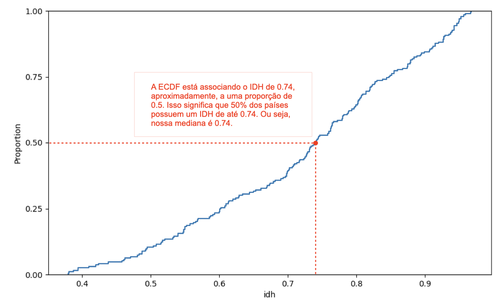
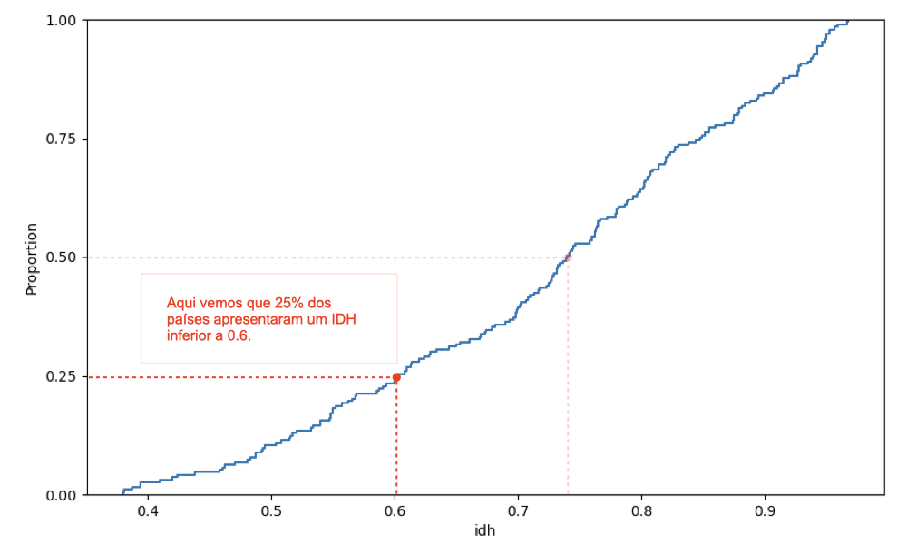
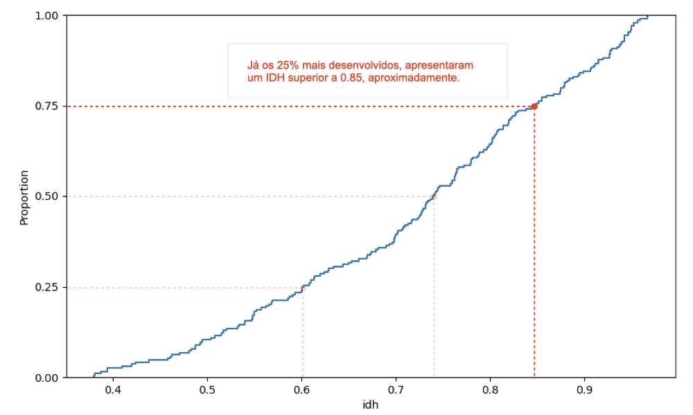
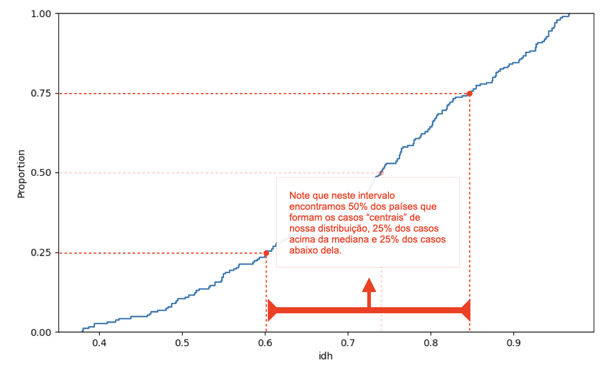

# Explorando distribuições – KDE, ECDF e Boxplot
**Programação para Advogados – 2024.2**
José Luiz Nunes e Lucas Thevenard

---
<!-- 
paginate: true 
header: Explorando distribuições – KDE, ECDF e Boxplot
footer: jose.luiz@fgv.br | lucas.gomes@fgv.br | 09/09/1986
-->

## O que aprendemos até aqui?

- **Argumentos no seaborn**
  * `x` e `y`
  * `data`
  * `hue`
  * `color`
  * `palette`
  * `hue_order`
  * `errorbar`
  * `estimator`

---

## O que aprendemos até aqui?

- **O que passamos para os argumentos?**
  * `x` e `y`:
    * variáveis numéricas ou categóricas - `str`
  * `data`:
    * nosso conjunto de dados - `pd.DataFrame`
  * `hue`:
    * variável categórica - `str`
  * `color`:
    * cor única - `str`

---

## O que aprendemos até aqui?

- **O que passamos para os argumentos?**
  * `palette`:
    * nome de paleta ou conjunto de cores - `str`, `list`, ou `dict`
  * `hue_order`:
    * ordem das categorias - `list` de `str`
  * `errorbar`:
    * controla barra de erro - `None` (**não vimos como alterar**)
  * `estimator`:
    * função para resumir dados - `str`; `"mean"`, `"sum"`, `"median"`

---

## Roteiro de Aula

- Gráficos KDE e ECDF
- Quartis e intervalo interquartil
- Boxplot
- Query

---

### Passos Preliminares

---

## KDE (Kernel Density Estimate)

- Como podemos criar um gráfico para compreender a distribuição dos valores do IDH dos países em 2022 (coluna `"idh"` da nossa base) usando a função `kdeplot`?

  

  

---

## KDE (Kernel Density Estimate)

- Como podemos criar um gráfico para compreender a distribuição dos valores do IDH dos países em 2022 (coluna `"idh"` da nossa base) usando a função `kdeplot`?
  * Você consegue ver algum problema nesse gráfico?

  

---

  

  

---

## ECDF (Empirical Cum. Dist. Function)

- Como podemos criar um gráfico para compreender a distribuição dos valores do IDH dos países em 2022 (coluna `"idh"` da nossa base) usando a função `ecdfplot`?

  

  

---

## ECDF (Empirical Cum. Dist. Function)

- Como podemos criar um gráfico para compreender a distribuição dos valores do IDH dos países em 2022 (coluna `"idh"` da nossa base) usando a função `ecdfplot`?
  * Como interpretamos esse gráfico e quais são as suas limitações?

  

---

---

---

---

---

---

---

## A divisão de uma distribuição em quartis

- Vamos trabalhar com as idades de 12 pessoas.
- `Idade`: 22, 24, 25, 28, 30, 35, 40, 42, 45, 50, 54, 60.
* **Quartis como "partes" da distribuição de valores**:
  * Agora vamos dividir essa distribuição em quatro partes:

 

* **1º Quartil**
  -  22
  -  24
  -  25

* **2º Quartil**
  -  28
  -  30
  -  35

* **3º Quartil**
  -  40
  -  42
  -  45

* **4º Quartil**
  -  50
  -  54
  -  60

---

## A divisão de uma distribuição em quartis

- `Idade`: 22, 24, 25, 28, 30, 35, 40, 42, 45, 50, 54, 60.
* **Quartis como fronteiras entre as partes**:
  * Por vezes usamos o termo "quartil" para designar as **3 fronteiras** entre as partes da nossa distribuição:
    * **Q1**: divide o 1º quartil do 2º quartil. Ou seja, 25% dos casos estão abaixo desse valor.
    * **Q2**: divide o 2º quartil do 3º quartil. Abaixo desse valor teríamos metade dos casos, ou seja, **Q2 é a mediana**.
    * **Q3**: divide o 2º quartil do 3º quartil. Ou seja, 75% dos casos estão abaixo desse valor (e 25% estão acima).

---

## Intervalo Interquartil

- O intervalo interquartil ($IQR$) é dado pela distância entre $Q1$ e $Q3$. Ou seja:

 

$$IQR = Q3 - Q1$$

 

- O $IQR$ é importante porque ele nos dá uma medida do grau de dispersão da nossa distribuição, tomando como base os casos "centrais", ou seja, os valores que estão em torno da nossa mediana.

---

---

