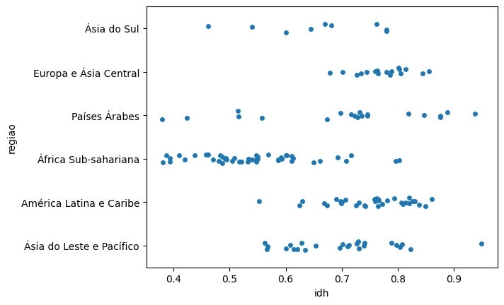

<style>

:root{
  font-family: "Source Sans Pro", sans-serif;
}

section {
  background-image: url(default_bg.png);
  font-family: "Source Sans Pro", sans-serif;
}
h1, h2, h3, strong {
  color: #003E7E;
}
h3, h4, h5 {
  text-align: center;
}
h4, h5 {
  font-weight: normal;
}
h1 {
  font-size: 200%;
}
h2, h3 {
  font-size: 150%;
}
h4 {
  font-size: 100%;
}
h5 {
  font-size: 75%;
}
header, a {
  color: #058ED0;
}
header {
  font-size: 85%;
}
footer {
  color: black;
  font-size: 60%;
}
blockquote {
  background: #f9f9f9;
  font-style: italic;
  font-family: Source Sans Pro;
  font-size: 80%;
  line-height: 170%;
  border-left: 10px solid #ccc;
  margin: 1.5em 20px;
  padding: 1.2em 30px;
  quotes: "\201C""\201D""\2018""\2019";
}
blockquote p {
  display: inline;
}
section::after {
  content: attr(data-marpit-pagination) ' / ' attr(data-marpit-pagination-total);
  color: #003E7E;
  font-size: 60%;
}
table {
  margin-left: auto;
  margin-right: auto;
}
th {
  background-color: #003E7E;
  color: white
}
.columns {
  display: grid;
  grid-template-columns: repeat(2, minmax(0, 1fr));
  gap: 1rem;
}
.columns3 {
  display: grid;
  grid-template-columns: repeat(3, minmax(0, 1fr));
  gap: 1rem;
}
.codeimage {
  display: grid;
  grid-template-columns: 35% 65%;
  gap: 1rem;
}

.codeimage2 {
  display: grid;
  grid-template-columns: 30% 70%;
  gap: 1rem;
}
span.under {
  text-decoration: underline;
}

span.fade {
  color: lightgray!important;
}

section > h2 {
  flex: 0.2 0 auto;
  padding: 0;
  margin: 0;
  order: -999999;
}

section:has(> h2)::before {
  flex: 1 0 auto;
  display: block;
  content: '';
  order: 999999;
}

</style>


# Pointplot: selecionando pontos e mais distribuições

**Programação para Advogados – 2024.2**
José Luiz Nunes e Lucas Thevenard

---

<!-- 
paginate: true 
header: Aula 7 - Selecionando pontos e mais distribuições
footer: jose.luiz@fgv.br | lucas.gomes@fgv.br | 16/09/2024
-->

## Roteiro da Aula

- Pointplot
  1. Selecionando pontos específicos
  2. Intervalo de valores
  3. Customização

- Lembrando: Definindo cores para categorias

- Stripplot e Swarmpot

---

## Vamos carregar os dados

```python
import pandas as pd
import seaborn as sns
import matplotlib.pyplot as plt

idh = pd.read_csv("https://bit.ly/idh_tidy")

idh.head()
```

Estamos voltando para o dataset de IDH que contém a série histórica dos países.

**Atenção**: Chamamos nosso dataset de `idh`.

---

## Pointplot

- Em aulas anteriores, vimos como criar gráficos de linha com o `lineplot`.

- Vimos também que poderíamos destacar a mudança total com o `pointplot`, mas não fizemos esse gráfico.

- Agora temos todos os recursos para criar um gráfico nesse formato.

---

## Pointplot

Qual o passo a passo necessário para criar esse gráfico com a função `pointplot`?

<div class="codeimage">

<div>


</div>

<div>


</div>

</div>

---

## Pointplot

Qual o passo a passo necessário para criar esse gráfico?

<div class="codeimage">

<div>

1. Selecionar os **pontos específicos** que queremos destacar.

</div>

<div>


</div>

</div>

---

## Pointplot

Qual o passo a passo necessário para criar esse gráfico?

<div class="codeimage">

<div>

1. Selecionar os **pontos específicos** que queremos destacar.
  a) Selecionar Países
  b) Selecionar Anos

</div>

<div>


</div>

</div>

---

## Pointplot

Qual o passo a passo necessário para criar esse gráfico?

<div class="codeimage">

<div>

1. Selecionar os **observações** para manter.
  a) Selecionar Países
  b) Selecionar Anos
2. Definir **paleta** de cores

</div>

<div>


</div>

</div>

---

## Pointplot

Qual o passo a passo necessário para criar esse gráfico?

<div class="codeimage">

<div>

1. Selecionar os **observações** para manter.
  a) Selecionar Países
  b) Selecionar Anos
2. Definir **paleta** de cores
3. Criar o **gráfico**

</div>

<div>


</div>

</div>

---


## Pointplot

**Começando**: para fazer a seleção precisamos da variável `ano` e `pais`.

- Como proceder para fazer cada filtro?

---


## Pointplot

**Começando**: para fazer a seleção precisamos da variável `ano` e `pais`.

- Como proceder para fazer cada filtro?

```python
anos_interesse = [1990, 2022]

idh_anos = idh.query("ano in @anos_interesse")
```

---


## Pointplot

**Começando**: para fazer a seleção precisamos da variável `ano` e `pais`.

- Como proceder para fazer cada filtro?

```python
paises_interesse = ["Brasil", "Argentina", "China"]

df_comp_paises = idh_anos.query("pais in @paises_interesse")
```

---

## Pointplot

Todo nosso processo:

```python
idh
# Começamos com os dados carregados na variável `idh`

anos_interesse = [1990, 2022]
idh_anos = idh.query("ano in @anos_interesse")
# criamos uma nova variável com os anos de interesse

paises_interesse = ["Brasil", "Argentina", "China"]
df_comp_paises = idh_anos.query("pais in @paises_interesse")
# criamos uma terceira variável com os países de interesse
# Usamos idh_anos par manter o filtro anterior
```

**Pergunta**: Se alterarmos a ordem dos filtros, o resultado será o mesmo?

---

## Pointplot

Todo nosso processo:

```python
idh
# Começamos com os dados carregados na variável `idh`

anos_interesse = [1990, 2022]
idh_anos = idh.query("ano in @anos_interesse")
# criamos uma nova variável com os anos de interesse

paises_interesse = ["Brasil", "Argentina", "China"]
df_comp_paises = idh_anos.query("pais in @paises_interesse")
# criamos uma terceira variável com os países de interesse
# Usamos idh_anos par manter o filtro anterior
```

**Se alterarmos a ordem dos filtros, o resultado será o mesmo!**

--- 

## Pointplot

Vamos montar a paleta de cores:

```python
cores_pais = {
    "Brasil": "tab:green",
    "China": "tab:orange",
    "Argentina": "tab:blue",
}
```

---

## Pointplot

<div class="codeimage">

<div>
Agora estamos prontos para criar o gráfico:

<br>

```python
sns.pointplot(
    x="ano",
    y="idh_ee",
    hue="pais",
    palette=cores_pais,
    data=df_comp_paises,
)
```
</div>

<div>


</div>

</div>

---

## Pointplot

O estilo de gráficoq ue criamos pressupõe que temos uma única observação, com o valor ponto para ser visualizado.

O pointplot também pode ser usado para exibir a variação. Na verdade, é uma opção melhor que o gráfico de barras, por exemplo.

---

## Pointplot

Vamos restringir os dados para o ano de 2022 para prosseguir:

```python
idh_2022 = idh.query("ano == 2022")
```

<br>

**Atenção**: O resultado dessa linha será o **mesmo conjunto de dados** que utilizamos em outras aulas, mas carregado diretamente: as informações do IDH de cada país para o ano de 2022.

---

## Pointplot

<div class="codeimage2">

<div>

Passando ao gráfico:

<br>

```python
sns.pointplot(
    x="idh",
    y="regiao",
    data=idh_2022
)
```

</div>

<div>


</div>

</div>

---

## Pointplot

<div class="codeimage">

<div>

O `pointplot` liga os pontos, semelhante ao `lineplot`.

Ele pode ser usado para destacar variação temporal de variáveis, ou entre categorias não associadas a passagem do tempo.

Também podemos remover a linha, o que em muitos casos é uma ideia melhor.

</div>

<div>


</div>

</div>

---

## Pointplot

<div class="codeimage">

<div>

Vamos remover a linha:

```python
sns.pointplot(
    x="idh",
    y="regiao",
    linestyle="", # <----
    data=idh_2022
)
```

Ponto é a média.

Barra de erro é o intervalo de confiança, como nas demais funções.

</div>

<div>


---

## Barras de erro

O seaborn usa um método estatístico chamado *bootstrapping* para calcular o intervalo de confiança de 95% exibido por padrão.

Não precisamos nos preocupar com como isso é feita agora, mas vamos aprender a mudar a barra de erro.

---

## Barras de erro

Para isso vamos usar a ideia de percentil, que generaliza o conceito de quartil para qualquer percentual.

*E.g.*  o percentil 25 é equivalente ao primeiro quartil. O percentil 43 é maior que 43% dos valores (e menor que 57%).

---

## Barras de erro

Barra de erro com percentil 50:

<div style="text-align: center">


<!-- Código para plot:
with sns.axes_style(
    rc={
        "axes.edgecolor": "lightgray",
        "ytick.color": "dimgrey",
        "xtick.color": "dimgrey",
        "xlabel.color": "dimgrey",
        "grid.color": "lightgray",
        "axes.axisbelow": True,
    },
):

    fig, ax = plt.subplots(figsize=(6,4))

    sns.pointplot(
        x="idh",
        y="regiao",
        linestyle="",
        capsize=0.2,
        errorbar=["pi", 50],
        # estimator="median",
        color="steelblue",
        data=idh_2022,
        zorder=2,
        ax=ax
    )

    sns.boxplot(
        x="idh",
        y="regiao",
        data=idh_2022,
        color="gray",
        fill=False,
        whis=0,
        showcaps = False,
        showfliers = False,
        zorder=0,
        ax=ax
    )

    sns.despine(ax=ax, left=True, bottom=True)

    ax.grid(axis="x", linestyle="--", alpha=0.8)

    ax.set_title("Comparação de barra de erro com percentil 50\ne boxplot com bigode e outliers removidos", loc="left")
    ax.set_ylabel("")

 -->

---

## Barras de erro

Podemos mudar o estimador para `estimator="median"`:

<div style="text-align: center">


---

## Barras de erro

Para fazer a barra de erro desse modo devemos passar o argumento:

<br>

`errorbar=["pi", 50]`

<br>

Podemos mudar o 50 para o valor desejado entre 0 e 100.

---

## Pointplot

<div class="codeimage">

<div>

Vamos também exibir o limite da barra de erro usando o argumento `capsize` seguido de um valor numérico:

<br>

```python
sns.pointplot(
    x="idh",
    y="regiao",
    linestyle="",
    capsize=0.2, # <-----
    errorbar=["pi", 50],
    data=idh_2022
)
```

</div>

<div>


</div>

</div>

---

## Distribuições

Vimos muitas formas diferentes de exibir a distribuição de variáveis numéricas: `histplot`, `kdeplot`, `ecdfplot`, `boxplot`, `violinplot`.

Dessas, apenas quando usamos o `histplot` com contagem podemos passar informação sobre o total de observações. Mas histogramas são difíceis de comparar.

Temos outra alternativa para exibir a distribuição que permitem comparação entre categorias: `swarmplot`, `stripplot`.

---

## Stripplot

<div class="codeimage2">

<div>

Começamos com o `stripplot`. Não temos nenhuma novidade:

<br>

```python
sns.stripplot(
    x="idh",
    y="regiao",
    data=idh_2022
)
```

</div>

<div>



</div>
</div>

---

## Swarmplot

<div class="codeimage2">

<div>

O `swarmplot` é uma variação do `stripplot` que evita a sobreposição de pontos:

<br>

```python
sns.swarmplot(
    x="idh",
    y="regiao",
    data=idh_2022
)
```

</div>
<div>


</div>
</div>

---

## Hue vs. Dois eixos

<div class="columns">

<div>
<br>


</div>
<div>
<br>


</div>
</div>

---

<br>


<div style="text-align: center">


---

### Mãos à obra!