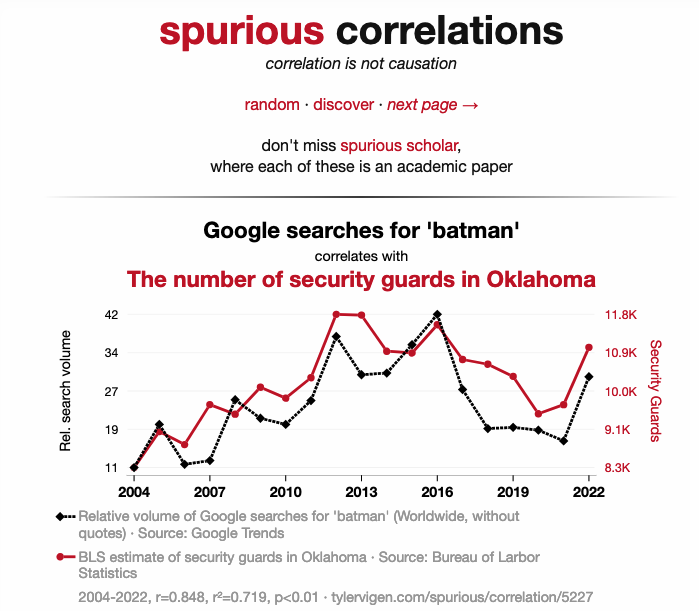

# Scatterplot e regplot: relações entre variáveis numéricas
**Programação para Advogados – 2024.2**
José Luiz Nunes e Lucas Thevenard

---
<!-- 
paginate: true 
header: Scatterplot e regplot: relações entre variáveis numéricas
footer: jose.luiz@fgv.br | lucas.gomes@fgv.br | 07/10/2024
-->

## O que aprendemos até aqui?

- **Argumentos no seaborn**
  * `x` e `y`
  * `data`
  * `hue`
  * `color`
  * `palette`
  * `hue_order`
  * `errorbar`
  * `estimator`

---

## O que aprendemos até aqui?

- **O que passamos para os argumentos?**
  * `x` e `y`:
    * variáveis numéricas ou categóricas - `str`
  * `data`:
    * nosso conjunto de dados - `pd.DataFrame`
  * `hue`:
    * variável categórica - `str`
  * `color`:
    * cor única - `str`

---

## O que aprendemos até aqui?

- **O que passamos para os argumentos?**
  * `palette`:
    * nome de paleta ou conjunto de cores - `str`, `list`, ou `dict`
  * `hue_order`:
    * ordem das categorias - `list` de `str`
  * `errorbar`:
    * controla barra de erro - `None` (**não vimos como alterar**)
  * `estimator`:
    * função para resumir dados - `str`; `"mean"`, `"sum"`, `"median"`

---

## Roteiro de Aula

- Scatterplot
- Regplot
  - O que é um modelo?
- Anotações em gráficos

---

### Passos Preliminares

---

---

## Convenção dos eixos

- Usualmente colocamos a variável que queremos entender/prever/explicar no **eixo y**.
  * Chamamos ela de "**variável de resposta**" ou "**variável dependente**".

* A variável utilizada para explicar o fenômeno é usualmente colocada no **eixo x**.
  * Chamamos ela de "**variável explicativa**" ou "**variável independente**".

---

## Scatterplot

- O gráfico ao lado é um scatterplot que relaciona a expectativa de vida dos países (eixo y) à expectativa de escolaridade (eixo x).
  * Qual é a relação entre essas variáveis evidenciada pelo gráfico mostra?

  

---

---

## Cuidado: correlação ≠ causalidade

- O gráfico parece suportar a ideia de que quando aumentamos a expectativa de escolaridade de um país a expectativa de vida aumenta daquela população aumenta.
- No entanto essa conclusão é precipitada!
  * Quais outras explicações podemos ter?
    * **Hipótese rival 1**: A direção da causalidade é a inversa: é o aumento da expectativa de vida que causa aumento da escolaridade.
    * **Hipótese rival 2**: Há uma terceira variável que está causando tanto o aumento da expectativa de vida como de escolaridade.
    * **Hipótese rival 3**: Não há nenhuma relação real entre esas variáveis. A correlação observada é fruto do acaso (correlação espúria).

---

 

#### [www.tylervigen.com](https://www.tylervigen.com/spurious-correlations)
  

---

---

---

### A reta como um modelo

---

### A reta como um modelo

---

### A reta como um modelo

---

### A reta como um modelo

---

### A reta como um modelo

---

### A reta como um modelo

---

### A reta como um modelo

A reta de tendência que encontramos e sua a equação podem ser entendidas também como um **'modelo linear'**, por meio do qual podemos estimar os valores da nossa variável de resposta (expectativa de vida) a partir de variáveis explicativas (nesse caso só temos uma: a expectativa de escolaridade).

Quando você ouvir a expressão "modelo" referindo-se a modelagem matemática, estatística, econômica, etc., não se assuste. **O modelo nada mais é do que uma ou mais equações matemáticas utilizadas para descrever relações entre variáveis e, a partir disso, fazer previsões ou estimativas**.

---

---

## Primeiro exemplo de anotação

- Vamos destacar a posição do Brasil no nosso scatterplot de Expectativa de vida x Expectativa de escolaridade. Para isso, começamos criando uma nova variável que utilizaremos para colorir o ponto do Brasil.

---

## Primeiro exemplo de anotação

---

## Primeiro exemplo de anotação

Precisamos agora das coordenadas do Brasil no gráfico, para adicionar uma anotação próxima ao ponto. O código abaixo obtém essas coordenadas, acrescidas de um pequeno espaço para evitar sobreposições.

---

## Primeiro exemplo de anotação

---

---

### Mãos à obra!